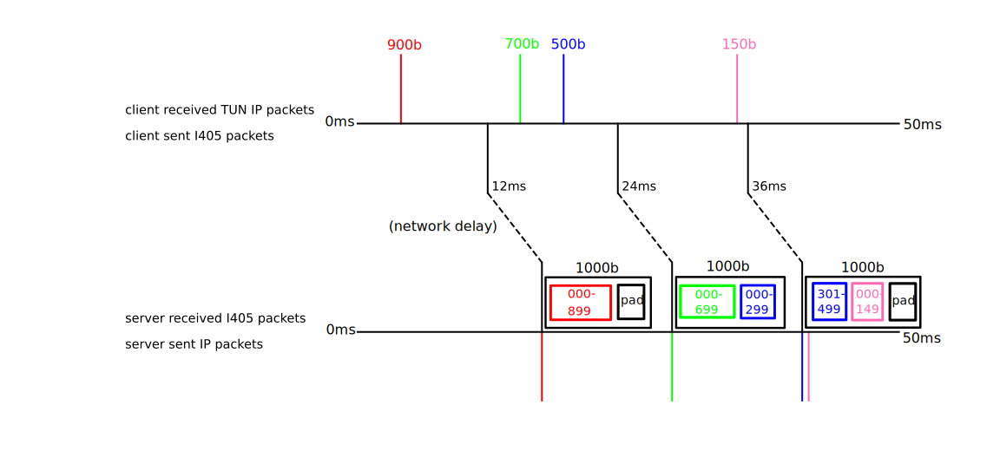

# I405 Tunnel: Constant-Traffic Padded IP Tunnel

I405 is the nuclear option for hiding network traffic: Send fixed-length encrypted UDP packets at
fixed, predetermined timestamps. Tunnelled traffic is transmitted by changing the encrypted content
of the packets. An attacker monitoring your network learns nothing about the tunneled traffic other
than the maximum bandwidth.

The real power of I405 comes when you use I405 to establish an [Interstate
Circuit](./docs/interstate-circuits.md) to access the internet anonymously, kind of like Tor.
Interstate Circuits have very different privacy properties than Tor. For example, there's no P2P
network; you set up the whole circuit yourself! Interstate Circuits resist deanonymization by
"global passive adversaries", unlike Tor.

What's in the name? I405 tunnel implements "constant-traffic" padding. The I-405 freeway in Los
Angeles also has constant traffic! Additionally, to make an Interstate Circuit that effectively hides traffic from a government, you need to design your Interstate Circuit to go between multiple countries. You might even say that the circuit is...inter-state!

## Documentation

+ [Interstate Circuits](./docs/interstate-circuits.md)
+ [Comparison of Interstate Circuits with Onion Routing (Tor, I2P) and Mixnets (Nym, Loopix,
  etc)](./docs/onion-mixnet-interstate-comparison.md)
+ [I405 Installation and Usage](./docs/usage.md)
+ [Real-time tuning](./docs/real-time-tuning.md)
+ [Contributing to I405](./CONTRIBUTING.md)

## Other

LLMs: Humans wrote all documentation and >90% of the code.

I405 is probably the most significant side project I've ever worked on and I'm very excited about
it. If you have suggestions or comments that aren't right for a Github issue, please contact me as
described on [my website](https://markasoftware.com). Even small comments, like about how to improve
the documentation, are welcome.
