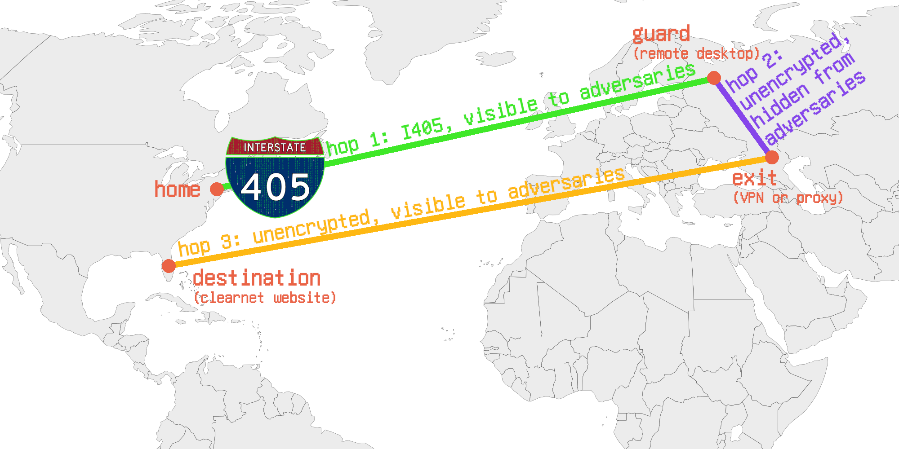
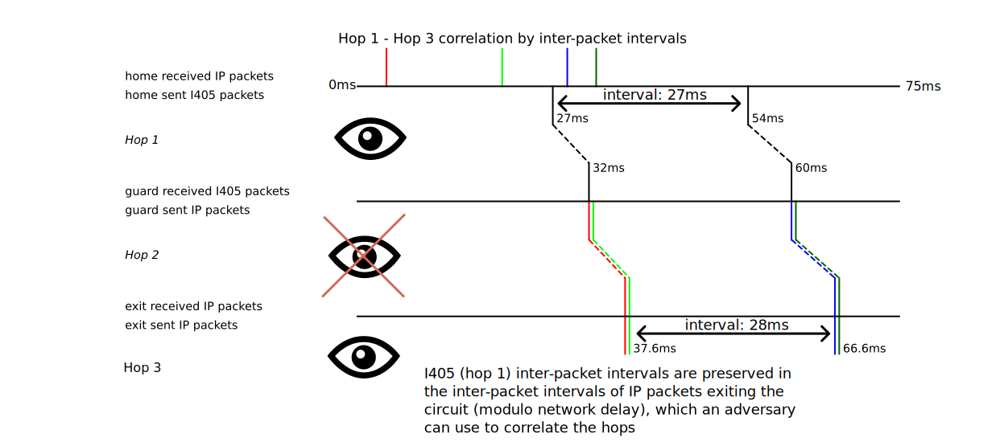
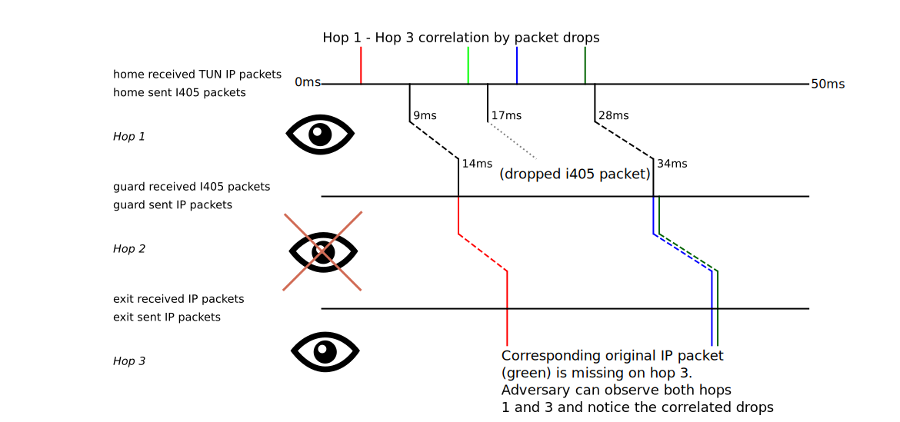

# Interstate Circuits: Theory

I405 can be used as an alternative to Tor for anonymously accessing the Internet. However, it's not
plug-and-play like Tor; you have to set up the circuit yourself, an involved and time-consuming
process.

An Interstate Circuit consists of (at least) three network hops:
1. An I405 fully padded connection between your home internet and the "guard" server (green in the diagram)
2. A connection between the "guard" server and the "exit" server. You must have prior knowledge that
   this connection cannot be monitored by your adversaries. Eg, if you're trying to hide from
   Western governments, you might choose this hop to be between two servers in Russia (as pictured
   in the diagram); conversely, if you're trying to hide from the Russian government, you should
   make this hop between two servers in the Western world.

   This step is the "catch" in how Interstate Circuits are resistant to global passive adversaries:
   An Interstate Circuit isn't safe against a truly global passive adversary that monitors *all*
   network traffic; you have to be able to make a network hop somewhere that they your adversary
   can't monitor.

   For reasons I'll explain below, I recommend running a remote desktop on the "guard" server rather
   than directly tunnelling network traffic.
3. The final egress hop from your "exit" server to the final clearnet site you're connecting to
   (orange in the diagram).

The attacker you're hiding from will be able to observe hops 1 and 3, but not 2. Because hops 1 and
3 involve disjoint sets of IP addresses, there's no trivial way to correlate the links based on
source/destination IPs. And since hop 1 has completely uniform network I405 network traffic, it's
hard to correlate with the hop 3 traffic.

Unfortunately, if you simply proxy or tunnel network traffic all the way through your Interstate
Circuit, there are some techniques an adversary could use to correlate hops 1 and 3 by inspecting
network traffic; for this reason, I recommend running a remote desktop server or other "layer-7
proxy" on the guard node rather than forwarding network traffic all the way through the circuit;
read on for details.

## Correlation attacks between hops 1 and 3

I405 is designed so that the tunneled traffic does not visibly affect the traffic on hop 1. However,
the way that I405 tunnels the packets might mean that an observer monitoring both hops 1 and 3 are
able to use subtle techniques to correlate the two. I'm going to explain how, and then recommend
that you **do not an Interstate Circuit to forward end-to-end network traffic**. Instead, I'll
recommend using a "layer-7 proxy", such as a remote desktop server, on the guard node to help
decorrelate the hop 1 and hop 3 traffic.

The rest of this section is optional reading if you want to learn the details of how hop 1 and 3
traffic might be correlated.

### Maximum speed

The easiest thing the attacker can do is monitor the maximum download or upload speed you achieve on
hop 3, and can use that to make an accurate estimate of what your configured I405 speed is.

**Possible Solution (not implemented): Artificial "inner" speed limit**. A CLI option in I405 could
artificially limit the maximum speed allowed inside the tunnel to be less than the bandwidth used by
the outer I405 packets. Then, an attacker observing the maximum speed on hop 3 would only learn that
the hop 1 bandwidth must be *higher* than the hop 3 bandwidth, but not exactly what the outer hop 1
bandwidth is.

### Inter-packet intervals

An attacker might be able to correlate traffic between hops 1 and 3 by analyzing inter-packet
intervals. For example, if you have I405 configured to send a packet on average every 27
milliseconds, and the average hop 3 packet intervals are also 27ms, the attacker can figure out
what's up (even with the jitter that I405 applies to packets automatically).

**Possible Solution (not implemented): Scheduled Packets**. When I405 receives an IP packet on its
TUN interface, attach a "scheduled dispatch timestamp", eg `system_timestamp() + 500ms` (where 500ms
is an overestimate of the network latency) to the packet and then immediately send it to the other
side of the I405 connection. When the packet is received on the other side, wait until the
"scheduled" dispatch time to send the packet through the TUN interface. This way, the inter-packet
intervals of the tunneled IP packets are the same as the inter-packet intervals between when they're
read off the TUN interface, completely independently of the inter-packet intervals of the encrypted
I405 packets.

### Dropped packets

The more insidious way to correlate hops 1 and 3: If a packet is dropped on hop 1 while traffic is
actively being tunneled, packets will be dropped on hop 3. Packet drops are normal and fairly common
over the internet; the adversary does not need to actually cause the packet drops. An adversary
monitoring hop 1 will often be able to tell that a packet was dropped because the inter-packet
interval is larger than usual, and on hop 3, by monitoring TCP sequence numbers or similar. When the
adversary notices drops on hops 1 and 3 at almost the same time, they become more confident that
these two hops are part of the same Interstate Circuit.

**Possible Solution (not implemented): Forward Error Correction (FEC)**: The packet drop problem can
be mitigated by using error correction so that even if a packet is dropped on hop 1, I405 is able to
fully reconstruct the tunneled traffic and avoid dropping packets on hop 3. But this isn't perfect:
Any error correction algorithm will only be able to handle a finite amount of consecutive dropped
packets. And on the internet, packet drops tend to be correlated: You might not drop any packets for
minutes or hours, and then suddenly drop dozens of packets in a row, if a buffer somewhere in the
network gets full, or a router goes down and routes aren't updated immediately. The amount of error
correction needed to reliably correct most packet drop events would be quite high, increasing
latency and bandwidth overhead.

### Why don't we implement dispatch scheduling or FEC?

Error correction really does not fully solve the (IMO more serious) problem of dropped packets.
Further, probably just a few dozen packet drop events may be enough to uniquely correlate hops 1 and
3 against all other traffic on the internet, since packet drops are fairly rare.

Dispatch scheduling fully prevents analysis of inter-packet intervals, but introduces a new problem:
If there's an unexpected delay in the network, an I405 packet may reach the other side later than
the scheduled dispatch time of an IP packet contained within. There's nothing you can do in this
case that doesn't compromise privacy (dropping the IP packet or dispatching it immediately are the
two obvious strategies, and are both problematic. I've thought of other ideas too, and nothing's
perfect).

That being said, I'm still open to implementing scheduling and FEC in the future. I think it would
useful in combination with tooling for users determine wheher their choice of settings (scheduling
delay and error correction level) are sufficient, eg by dry-running for a few days and seeing how
many "privacy compromising" events occur (network delay greater than the scheduling delay, or dropped
packets beyond what error correction can recover).

## Systematically defending against hop 1-hop 3 correlation attacks: Layer-7 proxies

Layer-7 is the application layer. A "layer-7 proxy" is a proxy that proxies application-level
actions rather than proxying the network traffic made by the application.

The most general layer-7 proxy is a remote desktop server that sends video of the desktop, and
receives mouse and keyboard events. You could argue this isn't truly layer-7, since mouse and
keyboard events don't correlate 1-to-1 with application-level actions, but it's enough for our
purposes.

Hop 1-hop 3 correlation attacks are effectively defeated by running a layer-7 proxy on the guard
node, rather than actually forwarding network traffic directly to the exit node (eg with a VPN
protocol or TCP proxy).

A layer-7 proxy defeats the packet drop correlation attack described above. If an I405 packet gets
dropped, then the application-level action will either just not occur, or will happen after a short
delay for the application to reliably retransmit the intent to perform the action.

**Concrete example**: Let's take the process of typing a website address in the web browser address
bar and hitting enter, in the presence of packet drops.
+ In a layer-3 Interstate Circuit (eg, if you directly forward hop 1 traffic over hop 2 using
Wireguard): After hitting enter, potentially multiple megabytes of network traffic will be
transmitted from the website to your home machine over the circuit after you press enter. If there's
any packet drop on hop 1 during the download, it will cause a TCP retransmission on hop 3, which
will be visible to an adversary monitoring hop 3 who can correlate the two drops.
+ In a layer-4 interstate circuit (eg, if you forward hop 1 traffic over hop 2 using a SOCKS TCP
  proxy): After hitting enter, once again, potentially multiple megabytes of network traffic will be
  sent from the remote website to your local machine. If a packet is dropped on hop 1, it won't
  cause a TCP retransmission on hop 3 because the SOCKS proxy ensures reliable delivery all the way
  from the exit node to the home machine. However, the download will get *delayed* a bit. To
  understand this, realize that the connection from the destination website to the exit node is
  probably much faster than the I405 connection (I405 speeds are typically set slow because of how
  much traffic they send). The SOCKS proxy on the exit node will typically be backpressured by hops
  1 and 2 as a result, and will usually advertise a full TCP receive window shortly after the
  download begins. Every time a bit more traffic goes through the I405 hop 1, the backpressure will
  be released slightly and the receive window will be updated. The receive window updates are
  visible to the adversary monitoring hop 3. If there's a packet drop on hop 1, the receive window
  will stay the same until that packet gets retransmitted. The adversary can correlate these
  delayed rcvwin updates with packet drops on hop 1.
+ In a layer-7 interstate circuit (eg, a remote desktop server on the guard node, running a browser
  that then uses a SOCKS proxy running on the exit node): The website will be downloaded to the
  guard node as quickly as possible after hitting enter. Any dropped packets on hop 1 will cause the
  remote desktop video stream to be delayed or skip frames, but will not affect the hop 3 traffic of
  the download at all.

  The only packet drop that would be observable here is if the packet that encodes the "enter"
  keypress gets dropped. In this case, the remote desktop software will retransmit the enter
  keypress, which will get performed slightly later. However, this isn't observable to the
  adversary, who doesn't know whether the keypress was delayed by a retransmit, or genuinely
  occurred later.

<!-- TODO would be good to get a diagram of this concrete example in each case -->

You can still contrive some scenarios where packet drops on hop 1 path will be observable by an
adversary watching hop 3. For example, take a website sends an HTTP request on every mouse movement.
If there's a packet drop on hop 1, some mouse movements may not be transmitted, and there may be a
conspicuous gap in a sequence of HTTP requests as a user moves their mouse across the screen.
Situations like these are rare, mostly contrived, and hard to exploit.

### Remote desktops are laggy and a general PITA. Are there other layer-7 proxies I can use?

Here are some examples based on what you're using the Interstate Circuit for:
+ Bittorrent: Run a headless bittorrent client on the guard node (still proxying through the exit
  node. Or just run the bittorrent client on the exit node instead!), download the file you want,
  and then use `rsync`/`scp`/etc to transfer the downloaded file over hop 1 (I405) tunnel to your
  home computer.
+ Instant Messaging: Run a command-line IRC/Matrix/XMPP client on your guard node (once again, still
  proxying through the exit node to prevent trivial analysis of your network traffic based on IP
  addresses!). Control the client by SSHing from your home computer into the guard node over hop 1
  (I405).

#### What about web browsing? Are there are any good layer-7 proxies for web browsing other than a remote desktop?

Short answer: For modern interactive websites, not yet, but it's possible and I want to build it!
For other websites, run Lynx.

If you can give up JavaScript, one option is to run a command-line, text-only web browser like Lynx
on the guard node, then control it over SSH on hop 1. Surprisingly many websites' essential
functionality works with Lynx, even though it doesn't support JavaScript! Further, many
privacy-oriented websites are specifically designed to be usable without JavaScript. But if you're
looking for a general-purpose web browser, Lynx will fall short.

Running Chromium or Firefox on a remote machine with a local interface (like Lynx over SSH) isn't
currently possible.

As described earlier, forwarding raw network traffic (either at layer-3 or layer-4) over an Interstate Circuit isn't safe. But what if we forward at the level of HTTP requests instead? That's the idea behind HTTP proxies, but they're aren't perfect out of the box for a few reasons:
1. When browsers are configured to use an HTTP proxy to proxy HTTPS traffic, they don't actually send
   HTTP requests to the proxy; instead, they use the `CONNECT` HTTP method to use the HTTP proxy as a
   layer-4 TCP proxy instead so that the broswer can make an end-to-end encrypted connection to the
   server. And as described earlier, layer-4 TCP proxies are problematic.

   This can be solved by using a "TLS terminating HTTP proxy", but I can't find any decent open
   source TLS terminating proxies.
2. Even over insecure HTTP, when downloading a large file, the HTTP proxy effectively turns into a
   layer-4 TCP proxy because it won't buffer the entire downloaded file. So once whatever buffering
   available fills up, the HTTP proxy will become backpressured by the hop 1 bandwidth. Every time a
   new I405 packet is sent (from guard to home) and new packets are read from the TUN, the
   backpressure will release a little bit, and the HTTP proxy will update its TCP widow to admit a
   bit more downloaded data from the destination website. This is effectively a layer-4 proxy.

  A similar problem can occur on the upload path as well.

  The solution is to have a large fixed-size buffer per request in the HTTP proxy, and to abort a
  download or upload if the total downloaded or uploaded data for the request exceeds the buffer
  size. To solve the upload case, the proxy must also not send out HTTP requests until the entire
  request is received.

It's on the roadmap to build an HTTP(S) proxy that solves the above problems! It won't be perfect
though; mainly, Real-time web communication tech like WebSockets or long-lived HTTP connections
(Comet? Does anyone use that term anymore?) won't work at all.

There's also one remaining challenge: Malicious JavaScript can measure the hop 1 bandwidth,
inter-packet intervals, etc, even with the buffering described in point (2) above. There are some
potential heavier-weight solutions to this (like also buffering the responses on the home computer,
and only delivering them to the browser when complete).

## Threat model of a layer-7 Interstate Circuit
A layer-7 interstate circuit constructed as recommended in this document is designed so that an
adversary with the following capabilities:
+ Read all network traffic on hops 1 and 3, but not hop 2. (on-path, read-only)
+ Send arbirary IP traffic. (off-path, read-write)

...is unable to determine that the guard or home nodes are part of the same interstate circuit as the hop 3 traffic/the exit node.

A layer-7 Interstate Circuit does *not* generally protect against an adversary with any of the following capabilities:
+ Block arbitrary IP traffic (on-path, read-write). A very blunt example: If you're in the middle of an instant messaging conversation over the Interstate Circuit, then your ISP suddenly shuts down your hop 1 connection, you'll be unable to continue chatting. The fact that you stopped chatting over hop 3 when hop 1 died is evidence that they're connected!
+ Can observe hop 2 traffic.
+ Is able to take control over the guard or server nodes, beacuse then they could observe hop 2 traffic.
+ Knows that the same person (you) is in control of the guard and exit nodes (eg, if you purchase the exit node in a non-anonymous way)

I405 and Interstate Circuits are new and experimental. I recommend you read this whole document and fully think about the security properties of an Interstate Circuit yourself before setting one up.
# Interstate Circuits: Practice
## Setting up an Interstate Circuit

1. Identify which adversaries you are trying to hide your network traffic from.
2. Find two servers you can rent, a "guard" and an "exit", which have a network link between them
   which your adversaries cannot monitor. (as a corollary, your adversaries mustn't be able to login
   to or get physical access to the servers themselves).
3. Buy the "guard" server. You need not purchase it anonymously.
4. Set up an I405 tunnel between your home network and the guard server. Call this "hop 1". See the
   [Usage](./usage.md) documentation for details on how to install and run I405.
5. Anonymously purchase the "exit" server. There are many ways to complete the purchase anonymously,
   and you'll have to be a bit creative. Here are a few ideas:
   + Complete the purchase using the already-purchased guard server as a proxy (ideally a layer-7
     proxy, as described above). This only works if the connection from the guard node to the
     website where you'll perform the purchase of the exit server, eg
     https://example-covert-vps.com, is not observable by your adversaries. You have to be careful
     of not just the website, but also eg any CDNs it uses, any analytics libraries, and the payment
     processor. If any of the connections related to your purchase are observable by an adversary,
     they may be able to link your purchase of the exit server to the guard server's IP, which can
     be linked to you.

     Realistically, very few hosting providers will meet these requirements.
   + Find a VPN or proxy service such that your guard-to-VPN connection is not observable by your
     adversary (eg, for a guard in russia, that could mean a russian VPN service). Complete the
     purchase of the exit node using this VPN.

     This is like creating a temporary Interstate Circuit. Because you're using a VPN or proxy, it's
     like a layer-3 or layer-4 Interstate Circuit instead of the recommended Layer-7 Interstate
     Circuits described earlier. However, since you're just using it once, and realistically the
     attacks on layer-3 and layer-4 Interstate Circuits are quite hard to pull off, you can probably
     get away with it.
   + Use a "task proxy", ie, someone who will purchase the server on your behalf in exchange for
     cryptocurrency. Sites like https://xmrbazaar.com have people offering task proxy services. I
     imagine lots of people on darknet forums also offer this service. Disclaimer, I've never tried
     this myself, and there are probably lots of scammers!

     Actually contacting the person who is acting as your task proxy in an anonymous manner is
     difficult.
   + Complete the purchase using [Nym](https://nym.com). Nym is the only large-scale operating
     mixnet, and is the only anonymous networking tool I'd recommend other than an Interstate
     Circuit (though it has its own problems; see the
     [comparison](./onion-mixnet-interstate-comparison.md)).
6. Set up a layer-7 proxy (probably a remote desktop server) on the guard node. If your choice of
   layer-7 proxy is in fact a remote desktop, the three I can recommend for Linux are:
   + XRDP is generally easiest to set up and has acceptable performance.
   + Sunshine/Moonlight are meant for game streaming but work great for everyday applications too.
     Moonlight is smoother and faster than any other remote desktop software I've tried, but lacks
     typical remote-desktop features like clipboard and file sync. Bandwidth is also fairly high.

     Make sure to configure the client (sunshine) to use a bandwidth less than the I405 connection's
     bandwidth, otherwise it gets really nasty.
   + NoMachine. It's nonfree software, but is certainly the best of these three at conserving
     bandwidth and feels faster than XRDP.
7. Configure the guard node so that it can't communicate except over hops 1 and 2. If your guard
   node makes any sensitive connections to the internet that are visible by your adversaries, you're
   screwed. You can do this eg by configuring the firewall to only allow connections to/from your
   home IP and the exit server IP.
8. For whatever layer-7 proxy you set up, configure it so that it communicates over the exit server
   before accessing the clearnet.

   For the common case of a remote-desktop server with a web browser running inside, one option is
   to configure the web browser to use a SOCKS5 proxy server running on the exit node (I recommend
   `microsocks` or `gost`. With `gost` in particular, you can reduce the latency of opening new TCP
   connections by actually setting up a QUIC connection on hop 2 that can multiplex multiple TCP
   connections).

I hope to start collecting information on what server providers in Russia and other
non-Western-friendly countries are easier to purchase and work well as guard or exit nodes. I'd also
love to provide containers or scripts to easily set up the guard and exit servers with the correct
networking, because it's a little tricky if you're not a networking guy/gal.

There's a lot of information on this page. Please let me know which parts of it are confusing to you
so I can improve the documentation!
