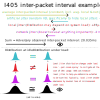

# I405 real-time performance

Adversaries can analyze the jitter in the timestamps of I405's sent packets to reveal some
information about one or both machines running I405. Specifically, if one system is under heavy
load, it typically makes the distribution of inter-packet intervals slightly tighter. Passing
`--poll-mode spinny` to I405 helps mitigate this by using a busy loop instead of `nanosleep` to wait
for scheduled packet transmissions.

I405 applies artificial jitter on inter-packet intervals to make it harder for an adversary to
determine anything about the "natural" jitter that contains the side-channel information. But as
described below, paranoid users are right to still be concerned that the *distribution* of jitter
changes slightly under load.

## Why and how inter-packet interval jitter leaks information

Jitter isn't enough to prevent all side-channel attacks. System load or other factors can also
influence the *distribution* of packet timings. For example: When packets are transmitted at exactly
the scheduled times, then due to the artificial jitter, the distribution of the time between packets
will have some specific variance/standard deviation. However, when the system is under heavy load,
the variance tends to decrease. So even though an adversary can't say anything based on the timing
of any individual packet, if the variance of the packet intervals from 8:30am-8:31am is greater than
the variance of the packet intervals from 8:29am-8:30am, the adversary may conclude that you were
more likely to be using your system, and hence transmitting traffic over the tunnel, from 8:30-8:31
than in the preceding minute.

You can now see why I405 makes efforts to dispatch packets at precisely the scheduled times. That
being said, the default configuration for I405 is not the configuration that achieves the highest
precision of packet send times. On my laptop, with I405's default configuration, under heavy system
load, the standard deviation of the difference between the actual and scheduled packet dispatch
times is up to about 20μs, and P99 differences are about 50μs. This is pretty good, all things
considered! Under load, the standard deviation *decreases* to about 5μs, and the P99 difference
decreases to about 20μs. Do you think someone observing your network will be able to tell the
difference between these two distributions, even on top of the artificial jitter? If so, then read
on for how to improve the consistency of the packet timings.

First, why do the packet timings get *more consistent under load*? To understand that, we have to
understand how I405 schedules packet dispatches in its default configuration. Roughly, the main
thread does its main loop of reading incoming packets on both the UDP socket and the TUN interface
until a fixed amount of time before the next outgoing UDP packet is scheduled to be sent. Then, it
constructs and encrypts that UDP packet. Finally, it uses the `nanosleep` syscall to wait until the
scheduled send time. As soon as the thread wakes up from the `nanosleep`, it uses the `sendto`
syscall to hand over the prepared UDP packet to the kernel.

The main source of inaccuracy is the difference between the requested wake-up time passed to
`nanosleep` and the actual time that control returns to the thread. `nanosleep` uses Linux's
`hrtimer` system, which uses high-resolution hardware timers which fire with very high precision (or
at least, with enough precision that the effects I describe below dominate the wake-up error). But
what happens after the hardware timer fires?
+ If the system is under light load, then shortly after the `nanosleep` syscall the physical cpu
core will typically enter a sleep state. On my system, the core enters the C3 sleep state after
`nanosleep`. When the hardware timer fires, the core has to wake up. On my system, waking up a core
from the C3 sleep state takes at least 100μs, but can take substantially longer. Surprisingly to me,
the wakeup time has quite high variance, in the tens of microseconds.
+ If the system is under heavy load, then after `nanosleep` the cpu core won't go to physical sleep
  -- instead, the scheduler will switch and execute a different process/thread on the same physical
  core. The core never enters a physical sleep state. Then, when I405 wakes up, the scheduler will
  switch back over from the other process back to I405. This is quite a lot faster than 100μs, and
  importantly, the time it takes for the scheduler to switch the running thread is more consistent
  than the physical core wake-up time (at least on my system), resulting in a lower variance across
  the differences in wake-up times.

It's worth noting that I405 uses the `sched_setscheduler` syscall to set its scheduling policy to
`SCHED_FIFO` (see the `sched (7)` manpage for details), which on a typical Linux system gives it
scheduler priority above all other threads and processes. So, when I405 is waking up from
`nanosleep` under heavy load, it will interrupt whatever other thread is running on the same core
without delay (unless the currently running thread is executing non-preemptible kernel code, which
usually won't take long to finish). This behavior can be disabled with `--no-sched-fifo`, but I
highly recommend leaving it enabled.

If you need the distribution of packet interval lengths to be more consistent between low-load and
high-load cases, then pass `--poll-mode spinny` to I405. This setting is not transmitted in the
handshake; you must set it on the client and server separately (though it's also ok to set it on
only one or the other). When running in `spinny` mode, I405 will never `nanosleep` or otherwise
yield the CPU for any reason. Instead, it changes to busy polling, both when listening for incoming
packets and

## Benchmarking the distribution of packet timings

Pass the `--outgoing-send-deviation-stats 10s` option on either client or server to print stats
about the distribution of actual vs expected inter-packet intervals to stdout every 10 seconds. Put
your system under load, send packets through the I405 tunnel, or do anything else that you're
worried about an adversary observing via side channel attacks, and then observe the stats and see if
they noticeably change.

At the time of writing, the "actual" inter-packet intervals are measured based on when the `send`
syscalls are made. It's on the roadmap to add the ability to measure interval deviation stats based
on timestamps reported from the Linux NIC drivers.

## In a VM (eg, a cloud VPS)

When constructing an Interstate circuit, it's common to have an I405 server running on a VPS, which
is a rentable VM running on a hypervisor that's shared with the hosting provider's other customers.
This throws a wrench into getting packets out on time, because the hypervisor can choose to schedule
out a core of your VPS, preventing it from executing any instructions until the hypervisor decides
it's its turn again.

For this reason, I recommend running I405 on bare metal when possible. That being said, we aren't
completely hosed just because we're running on a VM.

First, there are some elaborate schemes you could try and come up with. For example, if your VPS has
multiple cores, the hypervisor thinks of each core independently. So you could try to run something
on all the cores of a multicore VPS and then if at least one vCPU is scheduled at the time the next
packet is supposed to be transmitted, that thread can do the transmit.

I405 doesn't do anything so elaborate. Instead, we rely on the principle that if we keep vCPU at
constant load, then whether or not the hypervisor chooses to schedule that vCPU doesn't reveal
anything about the operation of *our* VM, just the other VMs on the same hypervisor.

Thus, on a VPS, I recommend using `--poll-mode spinny` to keep one CPU of the VPS completely busy.
Then, any scheduling decisions that the hypervisor makes with regards to that CPU should be
unrelated to what your VM is doing, because it's always fully using that core.

(Many VPS providers will be upset if you buy a cheap VPS and then fully utilize one of the CPU
cores; they usually have a "fair use" CPU usage policy which prohibits excessive CPU usage. So if
you want to peg a CPU core with `--poll-mode spinny`, we highly recommend renting a VPS with at
least four vCPUs, so that you aren't using more than a quarter of the burst CPU capacity of the VPS.
That ought to be "fair use". If you can find a provider offering "VDS" (virtual dedicated CPU), then
they probably won't get mad at you for pegging a CPU core)

More research into usage on VPSes is needed.

## Other tips for precise packet dispatch timing.

+ Disable energy-efficient-ethernet (EEE): `ethtool --set-eee <DEVNAME> eee off` (where `<DEVNAME>`
  is eg `enp5s0` in the output of `ip l`). Does not persist across reboots.
+ Generally disable any sort of power-saving stuff you can.
+ Avoid high egress traffic speeds for traffic that's not I405, on the entire LAN; such traffic can
  cause queueing delay at your internet router which could be used by an adversary to determine when
  you're sending high non-I405 egress traffic. And, similarly to system load, high egress traffic
  for any reason could indicate that you are "online" and generally using your network, and hence
  are more likely to be using the I405 connection as well.
+ Add the `preempt=full` linux kernel parameter. This will let userspace threads interrupt the
  kernel in more places. (If you're really hardcore, you could even setup `PREEMPT_RT`, but that's
  probably not necessary).

## `SO_TXTIME`

The Linux socket option `SO_TXTIME` can be used together with the `etf` qdisc to get the Linux
kernel to dispatch a packet at a given time. See the manpage `tc-etf (8)` for an alright
introduction to the topic. There are also some reasonably-priced network cards (Intel I210 and I225
series) that have hardware support for dispatching packets at specific times, which is perfect for
I405!

However, the software implementation of the `etf` qdisc uses an `hrtimer` to schedule when the packet
should be sent. Similarly to `nanosleep` (which also uses `hrtimer`), the variance of the accuracy
of the `hrtimer` will be different when the system is under load.

I405 when used as part of an Interstate circuit will be between one computer you have physical
control over and one you just rent. It's unlikely that the computer you're renting will happen to
have supported hardware. If it's virtualized, it certainly won't.

Since it's unlikely you'll have hardware support for `SO_TXTIME` on both sides of the I405
connection, and the software implementation is probably worse than `--poll-mode spinny`, I405 does
not support `SO_TXTIME`. I would still like to add support in the future, though! A possible future
direction is to write an eBPF program or kernel module that implements `SO_TXTIME` using a
non-preemptible spin loop instead of `hrtimer`; then we could really beat the userspace spin loop!
